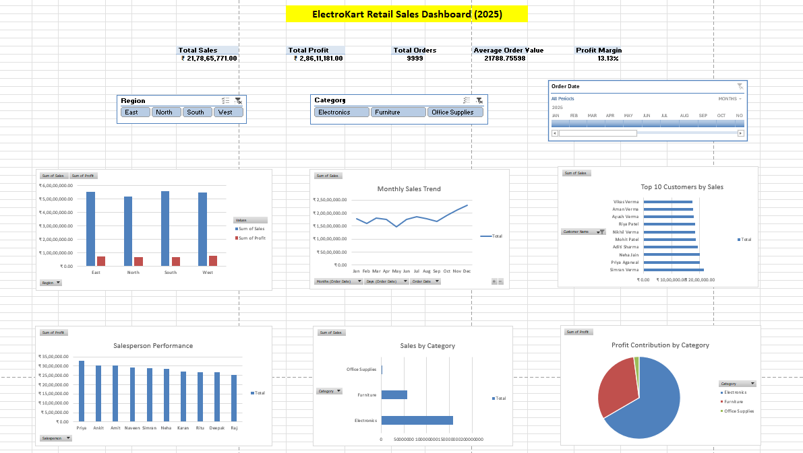

# 📊 Retail Sales Analysis Dashboard using Microsoft Excel

## Project Overview

This project presents an interactive Retail Sales Dashboard developed in Microsoft Excel to analyze business performance across multiple dimensions. The dashboard enables stakeholders to monitor sales, profit, customer performance, regional performance, and sales trends through interactive visualizations.

---

## Business Problem

ElectroKart Retail Pvt. Ltd. wanted an interactive dashboard to answer key business questions such as:

- Which region generates the highest sales?
- Which product category is the most profitable?
- Who are the top customers?
- How are monthly sales changing?
- Which salesperson performs the best?

The objective was to transform raw sales data into meaningful business insights that support data-driven decision making.

---

## Tools Used

- Microsoft Excel
- Pivot Tables
- Pivot Charts
- Slicers
- Timeline Filter
- Excel Tables
- Conditional Formatting
- Basic Excel Formulas

---

## Dataset Information

| Attribute | Value |
|-----------|-------|
| Total Records | 10,000 |
| Total Columns | 21 |
| Time Period | Jan 2025 – Dec 2025 |
| Categories | Electronics, Furniture, Office Supplies |
| Regions | North, South, East, West |

---

# Dashboard Preview



---

## Dashboard Features

- KPI Cards
    - Total Sales
    - Total Profit
    - Total Orders
    - Average Order Value
    - Profit Margin

- Sales & Profit by Region

- Monthly Sales Trend

- Sales by Category

- Top 10 Customers

- Salesperson Performance

- Interactive Slicers

- Timeline Filter

---

## Business Insights

- South region generated the highest overall sales.
- Electronics contributed the largest share of revenue.
- Top 10 customers accounted for a significant portion of total sales.
- Sales increased during the final quarter of the year.
- Salesperson performance varied across the organization, highlighting opportunities for coaching and performance improvement.

---

## Repository Structure

```
Retail-Sales-Analysis-Excel
│
├── Dashboard
├── Dataset
├── Images
└── README.md
```

---

## Skills Demonstrated

- Data Cleaning
- Exploratory Data Analysis (EDA)
- Dashboard Design
- Business Intelligence
- KPI Reporting
- Pivot Tables
- Pivot Charts
- Interactive Reporting

---

## Future Improvements

- Power Query for automated data cleaning
- SQL-based analysis
- Power BI dashboard
- Sales forecasting
- Customer segmentation

---

## Author

**Pooja Dixit**

Built as part of a Data Analytics portfolio project.